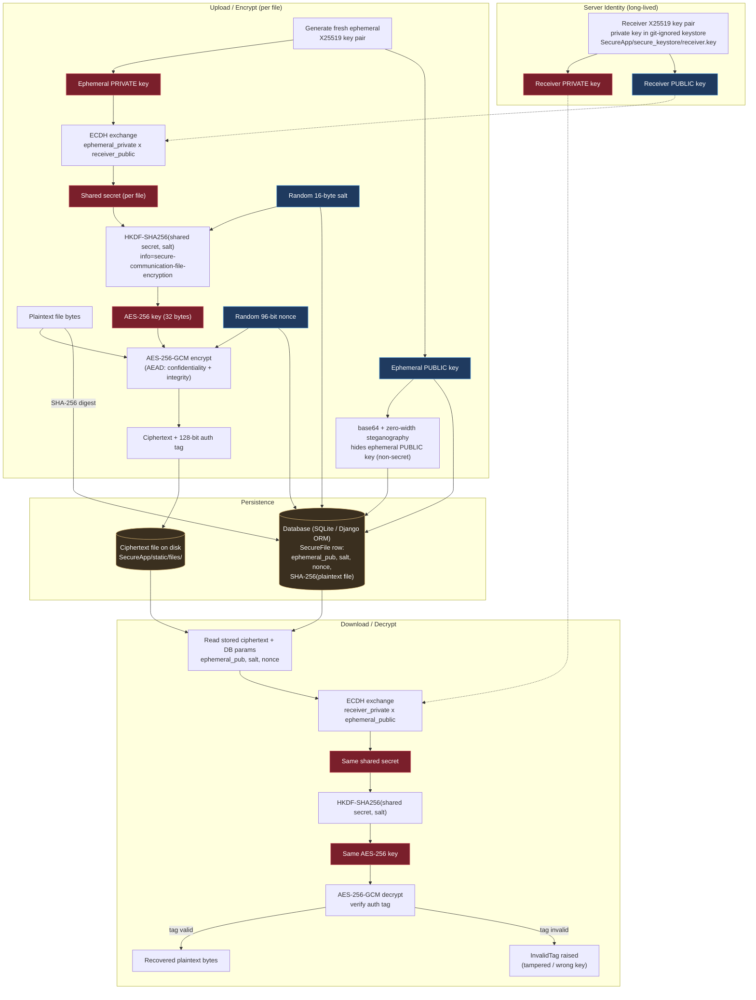

# Secure Communication using ECDH (X25519), AES-256-GCM & SHA-256

A Django web application for **secure file storage and transfer**. A user signs
up, logs in, and uploads a file — the file is encrypted at rest with modern
authenticated cryptography, its integrity is verifiable, and it can only be
downloaded and decrypted by its owner.

This project began as a college major project and was **security-hardened**: the
original implementation used broken, textbook cryptography and contained several
critical web vulnerabilities. Those were assessed and remediated — see
[`SECURITY.md`](SECURITY.md) for the full before/after report.

---

## 🔐 Cryptographic design

| Step | Algorithm | Purpose |
|---|---|---|
| Key agreement | **X25519 ECDH** (ephemeral-static, "sealed box" style) | Fresh shared secret per file |
| Key derivation | **HKDF-SHA256** with a random per-file salt | Derive a 256-bit AES key |
| Encryption | **AES-256-GCM** with a random 96-bit nonce | Confidentiality **and** authenticity (AEAD) |
| Integrity | **SHA-256** | Detect at-rest tampering of the stored file |
| Key hiding | Zero-width Unicode steganography | Demo: embeds the **public** ephemeral key in the file |

**How it works:** the server holds one long-lived X25519 *receiver* key pair
(the private key lives only in a git-ignored keystore). Every upload generates a
fresh *ephemeral* X25519 key pair; ECDH between the ephemeral private key and the
receiver public key yields a unique shared secret, which HKDF stretches into an
AES-256 key. The file is sealed with AES-256-GCM. Only non-secret values
(ephemeral public key, salt, nonce) are stored. To decrypt, the server combines
its receiver private key with the stored ephemeral public key to reconstruct the
same secret — the same construction as a libsodium *sealed box* / ECIES.

Because AES-GCM is an AEAD cipher, any modification to the ciphertext causes
decryption to fail with an authentication error — tampering cannot go unnoticed.

---

## 🗺️ Architecture

End-to-end cryptographic flow for uploading (encrypt) and downloading (decrypt) a file.
Red = secret material, blue = public/non-secret parameters, amber = persisted data.



---

## 🚀 Setup & run (zero external dependencies)

The app uses **SQLite**, so no database server is required.

```bash
# 1. Install dependencies
pip install -r requirements.txt

# 2. Apply migrations (creates db.sqlite3)
python manage.py migrate

# 3. Run
python manage.py runserver
```

Then open **http://127.0.0.1:8000/index.html**

Optional environment variables (defaults are fine for local development):

```bash
DJANGO_SECRET_KEY=<a-long-random-string>   # set for any non-local use
DJANGO_DEBUG=False                          # set for production
```

---

## 🌐 Application flow

1. **Register** — create an account at `/Signup.html` (passwords are Argon2-hashed).
2. **Login** — authenticate at `/UserLogin.html` (session-based).
3. **Upload** — the file is encrypted (X25519 ECDH → HKDF → AES-256-GCM) and stored.
4. **Download** — the owner recovers and decrypts their own files only.
5. **Integrity** — verify each stored file against its SHA-256 digest.

---

## 📁 Project structure

```
Secure-communication-project/
├── manage.py
├── requirements.txt
├── README.md
├── SECURITY.md                 # vulnerability assessment & remediation report
├── db.sqlite3                  # created by `migrate` (git-ignored)
├── Secure/                     # Django project settings
│   ├── settings.py             # SQLite, Argon2 hashers, env-driven secret/debug
│   └── urls.py
└── SecureApp/
    ├── crypto_utils.py         # X25519 ECDH + HKDF + AES-256-GCM + SHA-256 + stego
    ├── models.py               # Account (hashed pw), SecureFile (crypto params)
    ├── views.py                # ORM-based views, session auth, ownership checks
    ├── migrations/
    ├── templates/
    └── static/
        ├── files/              # encrypted file storage (git-ignored)
        └── secure_keystore/    # receiver private key (git-ignored, never committed)
```

---

## ⚠️ Notes

- For **educational purposes** — it demonstrates real cryptographic and secure
  web-development practices.
- The receiver private key is generated on first run and stored under
  `SecureApp/secure_keystore/`, which is git-ignored. In production it should be
  held in a secrets manager / HSM.
