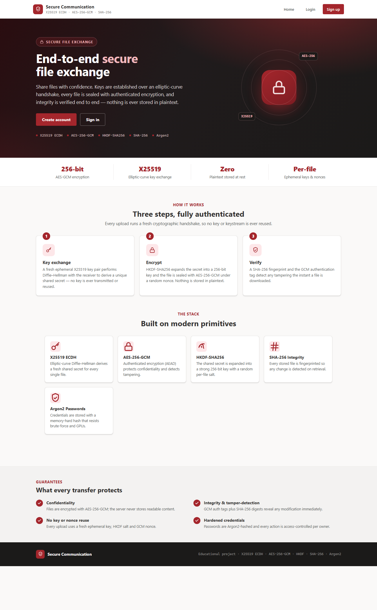
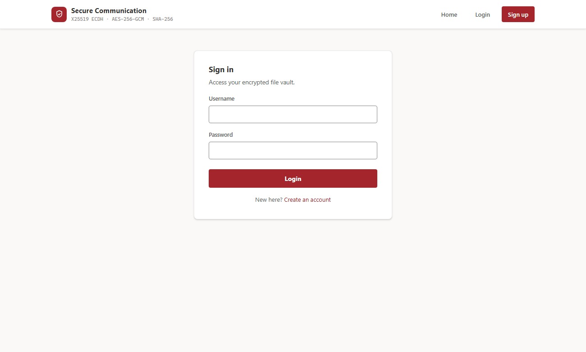
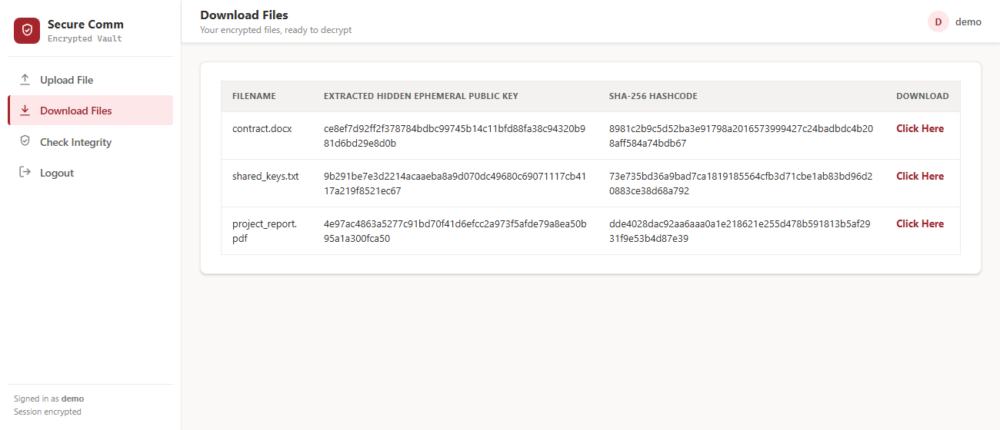
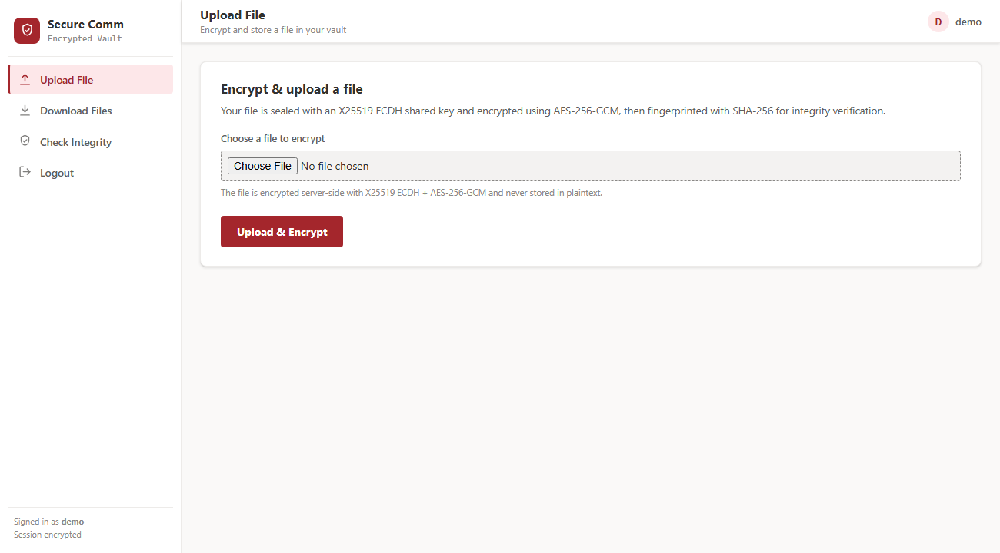
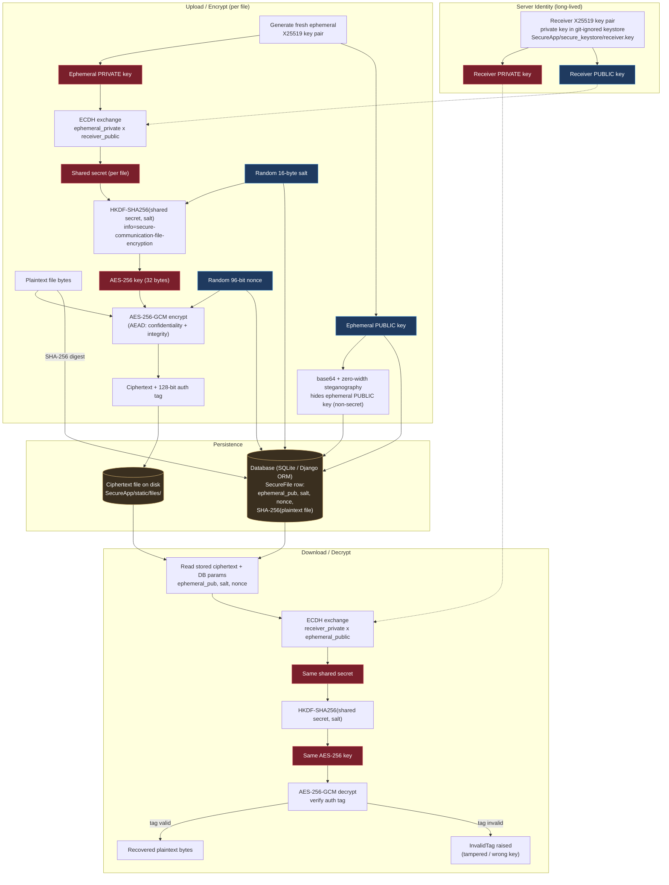

# Secure Communication using ECDH (X25519), AES-256-GCM & SHA-256

A Django web application for **secure file storage and transfer**. A user signs
up, logs in, and uploads a file — the file is encrypted at rest with modern
authenticated cryptography, its integrity is verifiable, and it can only be
downloaded and decrypted by its owner.

This began as a college major project and was **security-hardened and
penetration-tested**. The original build used broken textbook cryptography and
had multiple critical web vulnerabilities; those were remediated, then the app
was put through an automated attack battery and a multi-dimension red-team code
review. See the two reports:

- [`SECURITY.md`](SECURITY.md) — original vulnerability assessment & remediation (before → after)
- [`PENTEST.md`](PENTEST.md) — penetration test + red-team findings & resolutions

---

## Screenshots

| Landing | Sign in |
|---|---|
|  |  |

| Dashboard (encrypted files) | Upload (encrypt) |
|---|---|
|  |  |

---

## Cryptographic design

| Step | Algorithm | Purpose |
|---|---|---|
| Key agreement | **X25519 ECDH** (ephemeral-static, "sealed box" style) | Fresh shared secret per file |
| Key derivation | **HKDF-SHA256** with a random per-file salt, `info` bound to `owner\|filename` | Derive a 256-bit AES key |
| Encryption | **AES-256-GCM** with a random 96-bit nonce and `owner\|filename` as AAD | Confidentiality + authenticity, bound to identity |
| Integrity | **SHA-256** | Detect at-rest tampering of the stored file |
| Passwords | **Argon2id** | Memory-hard credential hashing |
| Key hiding | Zero-width Unicode steganography | Demo: embeds the **public** ephemeral key in the file |

**How it works:** the server holds one long-lived X25519 *receiver* key pair
(private key in a `0600` git-ignored keystore). Every upload generates a fresh
*ephemeral* X25519 key pair; ECDH with the receiver public key yields a unique
shared secret, which HKDF stretches into an AES-256 key. The file is sealed with
AES-256-GCM. Both the key derivation and the ciphertext are **bound to
`owner|filename`**, so a ciphertext cannot be transplanted onto another user's
row without failing authentication. Only non-secret values (ephemeral public
key, salt, nonce) are stored. This is the construction of a libsodium *sealed
box* / ECIES, plus AEAD identity binding.

---

## Architecture

End-to-end cryptographic flow for uploading (encrypt) and downloading (decrypt) a file.
Red = secret material, blue = public/non-secret parameters, amber = persisted data.



---

## Security hardening

- **No SQL injection** — Django ORM everywhere (parameterized).
- **Auth** — Argon2id passwords, enforced password policy, session-based login
  with **session rotation** on login, **per-IP login throttling**, timing-equalized
  login, and a login guard on every protected view.
- **Access control** — per-owner isolation on every file operation (IDOR-safe).
- **Files** — stored in a **private directory outside the web root**, streamed
  only through the authenticated view; filenames sanitized; path-traversal
  guarded; per-user quota; 10 MB upload cap.
- **Transport/headers** — CSP, `X-Frame-Options: DENY`, `nosniff`,
  `Referrer-Policy`, `Permissions-Policy`; in production: HTTPS redirect, HSTS,
  and `Secure`/`HttpOnly`/`SameSite` cookies.
- **Config** — fail-closed `DEBUG`, mandatory production `SECRET_KEY`, admin
  surface removed.

Full details and test evidence in [`PENTEST.md`](PENTEST.md).

---

## Setup & run (zero external dependencies)

The app uses **SQLite**, so no database server is required.

```bash
pip install -r requirements.txt
python manage.py migrate

# DEBUG is off by default (production-safe); enable it for local dev:
# Windows:  set DJANGO_DEBUG=True   (run.bat does this for you)
# bash:     export DJANGO_DEBUG=True
python manage.py runserver
```

Then open **http://127.0.0.1:8000/index.html**

For production, see **[`DEPLOYMENT.md`](DEPLOYMENT.md)** and
[`.env.example`](.env.example).

---

## Application flow

1. **Register** — create an account at `/Signup.html` (Argon2-hashed passwords).
2. **Login** — authenticate at `/UserLogin.html` (session-based).
3. **Upload** — the file is encrypted (X25519 ECDH → HKDF → AES-256-GCM) and stored privately.
4. **Download** — the owner recovers and decrypts their own files only.
5. **Integrity** — verify each stored file against its SHA-256 digest.

---

## Project structure

```
Secure-communication-project/
├── manage.py
├── requirements.txt
├── README.md
├── SECURITY.md              # vulnerability assessment & remediation
├── PENTEST.md               # penetration test + red-team report
├── DEPLOYMENT.md            # production deployment guide
├── .env.example             # environment variables template
├── Secure/
│   ├── settings.py          # SQLite, Argon2, hardened prod config
│   └── urls.py
└── SecureApp/
    ├── crypto_utils.py      # X25519 ECDH + HKDF + AES-256-GCM + SHA-256 + stego
    ├── views.py             # ORM views, session auth, throttling, ownership checks
    ├── middleware.py        # CSP + security response headers
    ├── models.py            # Account (Argon2), SecureFile (crypto params)
    ├── migrations/
    ├── templates/           # index, UserLogin, Signup, UploadFile, UserScreen
    └── static/style.css     # self-contained Defender-style UI (no external deps)
# generated / git-ignored at runtime:
# db.sqlite3, secure_store/ (ciphertext), SecureApp/secure_keystore/receiver.key, staticfiles/
```

---

## Notes

- For **educational purposes** — it demonstrates real cryptographic and secure
  web-development practices end to end.
- The receiver private key is generated on first run under
  `SecureApp/secure_keystore/` (git-ignored, `0600`). In production, hold it in a
  secrets manager / KMS — see [`DEPLOYMENT.md`](DEPLOYMENT.md).
